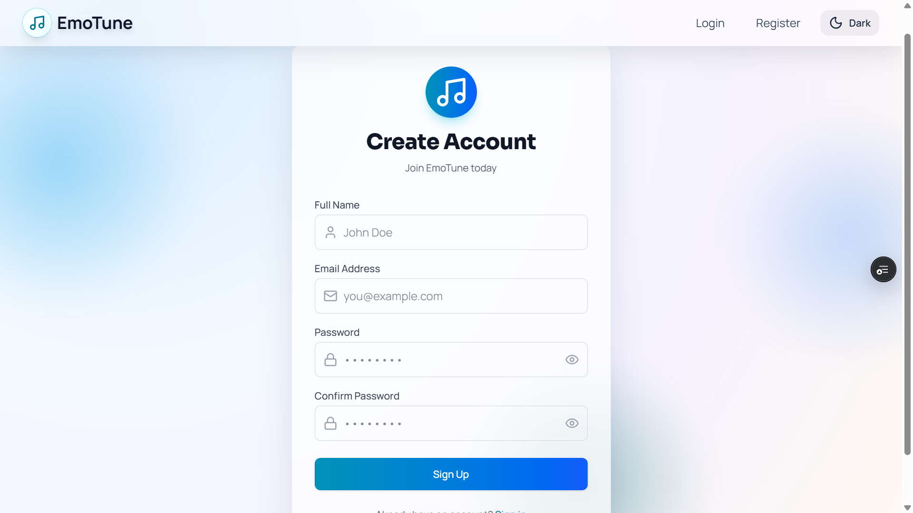
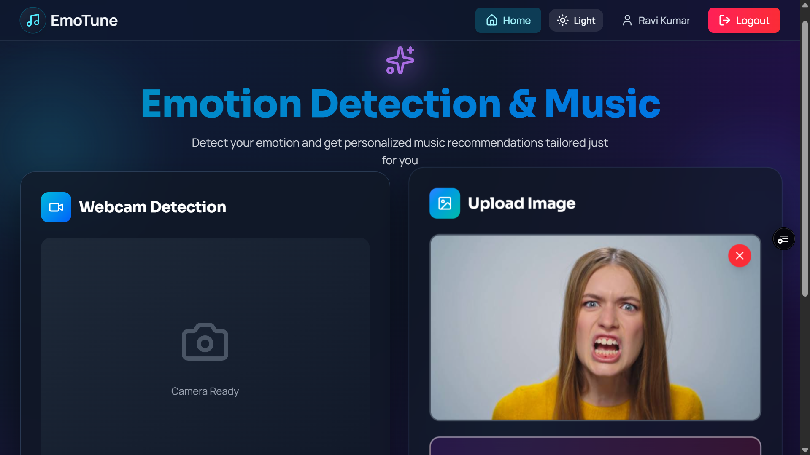
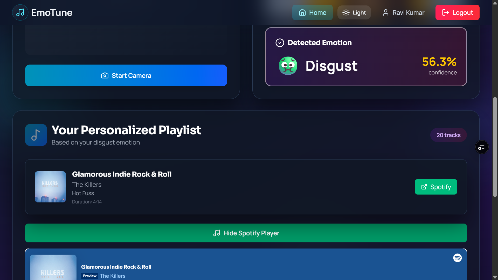
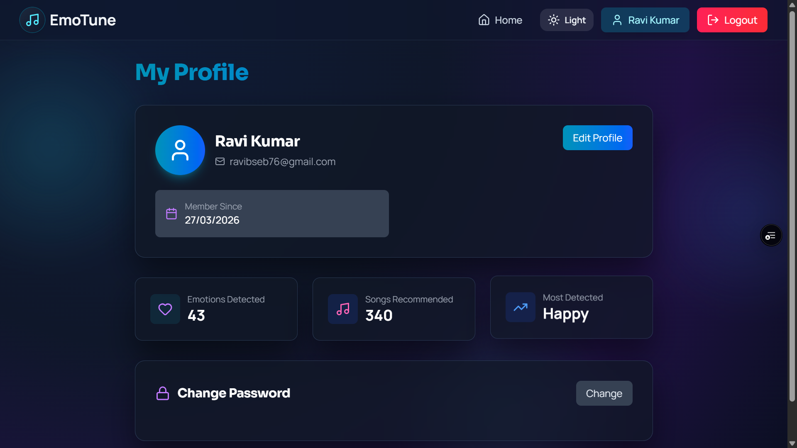
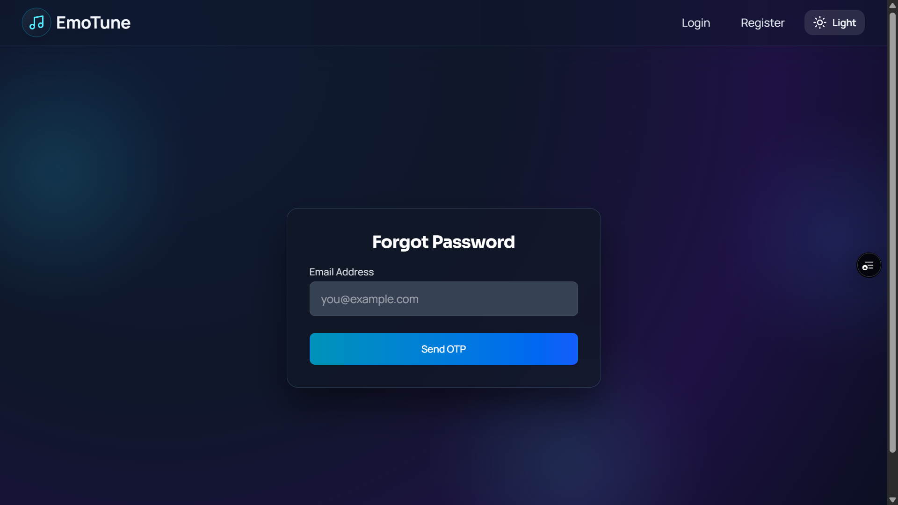

# EmoTune

Emotion-aware music recommendation platform that detects facial emotion from webcam or uploaded image, then generates personalized song recommendations.

## Live Applications

- Frontend (Vercel): https://emo-tune-rose.vercel.app
- Backend API (Render): https://emotune-3z19.onrender.com

## Deployment Architecture

- Frontend: Vercel
- Backend API: Render (Flask)
- Database: Railway (MySQL)
- ML model hosting: Hugging Face
- Notification service: SendGrid (OTP/email delivery)

## Key Features

- Secure authentication with JWT (register, login, logout, token verification)
- Emotion detection from:
  - webcam capture
  - uploaded image
- Music recommendation pipeline based on detected emotion and language preference
- In-app music player with track list, preview support, and Spotify link fallback
- User profile management:
  - update profile details
  - change password
  - password reset via OTP flow
- User activity and recommendation history tracking
- Responsive UI with dark/light theme toggle and mobile-first layouts

## Tech Stack

- Frontend
  - React 19
  - Vite
  - Tailwind CSS 4
  - React Router
  - Axios
  - Framer Motion
  - React Toastify
- Backend
  - Flask
  - Flask-CORS
  - Flask-JWT-Extended
  - Werkzeug security helpers
  - MySQL Connector/Python (connection pooling)
- ML / Inference
  - Model assets in `ml/`
  - Hosted inference/model deployment via Hugging Face
- Infra / Services
  - Railway (MySQL)
  - Render (API hosting)
  - Vercel (frontend hosting)
  - SendGrid (OTP/email notifications)

## Screenshots











## Project Structure

```text
EmoTune/
├─ app.py
├─ Procfile
├─ runtime.txt
├─ requirements.txt
├─ README.md
├─ backend/
│  ├─ __init__.py
│  ├─ config/
│  │  ├─ __init__.py
│  │  └─ database.py
│  └─ routes/
│     ├─ __init__.py
│     ├─ auth_routes.py
│     ├─ emotion_routes.py
│     ├─ forgot_password_routes.py
│     ├─ music_routes.py
│     └─ profile_routes.py
├─ frontend/
│  ├─ index.html
│  ├─ package.json
│  ├─ vite.config.js
│  ├─ public/
│  └─ src/
│     ├─ App.jsx
│     ├─ App.css
│     ├─ index.css
│     ├─ main.jsx
│     ├─ assets/
│     ├─ components/
│     │  ├─ MusicPlayer.jsx
│     │  ├─ ProtectedRoute.jsx
│     │  └─ layout/
│     │     └─ Navbar.jsx
│     ├─ config/
│     │  └─ api.js
│     ├─ context/
│     │  ├─ AuthContext.jsx
│     │  └─ ThemeContext.jsx
│     ├─ pages/
│     │  ├─ Home.jsx
│     │  ├─ Login.jsx
│     │  ├─ Register.jsx
│     │  ├─ Profile.jsx
│     │  ├─ ForgotPassword.jsx
│     │  ├─ ResetPassword.jsx
│     │  └─ History.jsx
│     └─ utils/
│        └─ axios.js
├─ ml/
│  ├─ data/
│  ├─ models/
│  ├─ notebooks/
│  ├─ utils/
│  └─ hugging-face/
└─ docs/
```

## Local Development Setup

### Prerequisites

- Node.js 18+
- Python 3.9+
- MySQL (or Railway MySQL instance)
- Git

### 1) Clone and install

```bash
git clone https://github.com/developer-ravi-03/EmoTune.git
cd EmoTune
```

### 2) Backend setup

```bash
python -m venv venv
# Windows
venv\Scripts\activate
# macOS/Linux
source venv/bin/activate

pip install -r requirements.txt
```

Start backend:

```bash
python app.py
```

Backend default URL:

```text
http://127.0.0.1:5000
```

### 3) Frontend setup

```bash
cd frontend
npm install
npm run dev
```

Frontend default URL:

```text
http://127.0.0.1:5173
```

## Environment Variables

Create `.env` files for backend root and frontend.

### Backend `.env` (root)

```env
FLASK_ENV=development
FLASK_PORT=5000
FLASK_SECRET_KEY=your_flask_secret

JWT_SECRET_KEY=your_jwt_secret
JWT_ACCESS_TOKEN_EXPIRES=3600

DB_HOST=your_db_host
DB_PORT=3306
DB_USER=your_db_user
DB_PASSWORD=your_db_password
DB_NAME=your_db_name

SPOTIFY_CLIENT_ID=your_spotify_client_id
SPOTIFY_CLIENT_SECRET=your_spotify_client_secret
SPOTIFY_REDIRECT_URI=http://127.0.0.1:5173/callback

YOUTUBE_API_KEY=your_youtube_api_key
MUSICHERO_API_KEY=your_musichero_api_key

EMAIL_FROM=your_verified_sender_email
SENDGRID_API_KEY=your_sendgrid_api_key
```

### Frontend `.env` (frontend folder)

```env
VITE_API_URL=http://127.0.0.1:5000/api
```

For production frontend deployment:

```env
VITE_API_URL=https://emotune-3z19.onrender.com/api
```

## API Overview

Base URL (production):

```text
https://emotune-3z19.onrender.com/api
```

Main route groups:

- `/auth`
- `/emotion`
- `/music`
- `/profile`
- `/forgot-password`
- `/reset-password`

Health check:

```text
GET /api/health
```

## Authentication Flow

1. User registers or logs in.
2. Backend returns JWT access token.
3. Frontend stores token and sends it as `Authorization: Bearer <token>`.
4. Protected endpoints validate JWT and process requests.

## Emotion-to-Music Workflow

1. Capture image from webcam or upload from device.
2. Backend predicts emotion using the deployed ML model pipeline.
3. Emotion is stored in history.
4. Music recommendations are fetched using emotion + selected language.
5. Track list is returned and displayed in music player UI.

## Security and Reliability Notes

- Passwords are hashed before storage.
- JWT-protected profile and history endpoints.
- CORS configured for local and deployed frontend origins.
- DB access uses connection pooling for better performance.
- OTP reset flow includes expiry handling.

## Troubleshooting

- CORS errors:
  - ensure frontend URL is allowed in backend CORS config
- 401 errors:
  - confirm token exists and is still valid
- DB connection issues:
  - verify Railway credentials and network access
- Email/OTP not sent:
  - verify SendGrid API key and sender identity

## Repository

- GitHub: https://github.com/developer-ravi-03/EmoTune.git

## 👨‍💻Author

- Ravi Kumar
- Computer Science Student
- Full Stack Developer

## Acknowledgement

This project combines full-stack engineering and practical ML deployment with independent cloud hosting across Vercel, Render, Railway, and Hugging Face.
